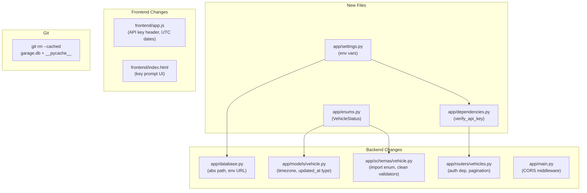

# Fix All Review Findings

## Architecture of changes



---

## Finding 1 — Critical: No authentication

**Strategy:** Static API key read from an env var. Dev mode (no key set) passes all requests through. A FastAPI `Security` dependency is applied to every vehicles endpoint.

**New file — `app/dependencies.py`**
```python
import os
from fastapi import Security, HTTPException, status
from fastapi.security import APIKeyHeader

_KEY_HEADER = APIKeyHeader(name="X-API-Key", auto_error=False)
_ADMIN_KEY  = os.getenv("ADMIN_API_KEY", "")

def verify_api_key(key: str | None = Security(_KEY_HEADER)) -> None:
    if _ADMIN_KEY and key != _ADMIN_KEY:
        raise HTTPException(status_code=status.HTTP_401_UNAUTHORIZED,
                            detail="Invalid or missing API key")
```

**[`app/routers/vehicles.py`](app/routers/vehicles.py)** — add `Depends(verify_api_key)` to all five endpoints, or pass it to `APIRouter(dependencies=[...])` to cover them all in one line.

**[`frontend/app.js`](frontend/app.js)** — `apiFetch` reads `sessionStorage.getItem('apiKey')` and adds `'X-API-Key'` to every request header. On a `401` response, the app prompts for the key (a small modal or `prompt()`), stores it in `sessionStorage`, and retries.

**[`frontend/index.html`](frontend/index.html)** — optional: add a small "Enter API key" modal (or reuse the existing modal pattern) shown on first 401.

---

## Finding 2 — Critical: VehicleUpdate validator guard is dead code

In Pydantic v2, `@field_validator` is never invoked for fields whose value is the default (`None`) and which were not present in the payload. The `if v is not None else None` guard is only reached when the client explicitly sends `"customer_name": null` — in which case returning `None` allows a null to propagate to a `NOT NULL` column.

**Fix in [`app/schemas/vehicle.py`](app/schemas/vehicle.py):** the guard should raise instead of silently pass `None` through:
```python
def validate_customer_name(cls, v: str | None) -> str | None:
    if v is None:
        raise ValueError("Customer name cannot be set to null")
    return _validate_name(v)
```

---

## Finding 3 — High: Timezone-naive DateTime

**[`app/models/vehicle.py`](app/models/vehicle.py)** — change all three `DateTime` usages to `DateTime(timezone=True)`:
```python
estimated_completion: Mapped[datetime | None] = mapped_column(DateTime(timezone=True), nullable=True)
created_at:  Mapped[datetime] = mapped_column(DateTime(timezone=True), default=_utc_now)
updated_at:  Mapped[datetime] = mapped_column(DateTime(timezone=True), default=_utc_now, onupdate=_utc_now, nullable=False)
```

SQLAlchemy will now return timezone-aware datetimes. Pydantic serialises them as `"2026-04-16T10:30:00+00:00"`. The browser correctly parses that as UTC.

**Note:** the existing `garage.db` stores naive values — delete the file after the code change so SQLAlchemy recreates the schema cleanly. (Alternatively, add Alembic — out of scope here.)

**[`frontend/app.js`](frontend/app.js)** — no change needed; `new Date("2026-04-16T10:30:00+00:00")` parses correctly already.

---

## Finding 4 — High: VehicleStatus enum duplicated

**New file — `app/enums.py`**
```python
import enum

class VehicleStatus(str, enum.Enum):
    IN_INSPECTION = "in_inspection"
    WAITING_PARTS = "waiting_parts"
    IN_PROGRESS   = "in_progress"
    READY         = "ready"
```

**[`app/models/vehicle.py`](app/models/vehicle.py)** — `from app.enums import VehicleStatus`

**[`app/schemas/vehicle.py`](app/schemas/vehicle.py)** — `from app.enums import VehicleStatus` (remove the local class)

---

## Finding 5 — Medium: No CORS configuration

**New file — `app/settings.py`**
```python
import os

ALLOWED_ORIGINS: list[str] = os.getenv("ALLOWED_ORIGINS", "*").split(",")
ADMIN_API_KEY:   str        = os.getenv("ADMIN_API_KEY", "")
DB_URL:          str        = os.getenv("DATABASE_URL", "")
```

**[`app/main.py`](app/main.py)** — add before `include_router`:
```python
from fastapi.middleware.cors import CORSMiddleware
from app.settings import ALLOWED_ORIGINS

app.add_middleware(CORSMiddleware, allow_origins=ALLOWED_ORIGINS,
                   allow_methods=["*"], allow_headers=["*"])
```

---

## Finding 6 — Medium: Database URL is hardcoded and CWD-relative

**[`app/database.py`](app/database.py):**
```python
from pathlib import Path
from app.settings import DB_URL

_default = f"sqlite:///{Path(__file__).parent.parent / 'garage.db'}"
SQLALCHEMY_DATABASE_URL = DB_URL or _default
```

The path is now absolute, resolved relative to `database.py`'s own location regardless of the working directory.

---

## Finding 7 — Medium: No pagination on `GET /vehicles/`

**[`app/routers/vehicles.py`](app/routers/vehicles.py):**
```python
@router.get("/", response_model=list[VehicleResponse])
def list_vehicles(skip: int = 0, limit: int = 200,
                  db: Session = Depends(get_db)) -> list[Vehicle]:
    return (db.query(Vehicle)
              .order_by(Vehicle.created_at.desc())
              .offset(skip).limit(limit).all())
```

---

## Finding 8 — Medium: Modal animation only fires once

**[`frontend/app.js`](frontend/app.js)** — in `openModal()`, reset the animation before showing:
```javascript
const card = document.getElementById('modal-card');
card.style.animation = 'none';
card.offsetHeight;        // force reflow so the reset takes effect
card.style.animation = '';
```

---

## Finding 9 — Low: `updated_at` typed as nullable

Already covered by the timezone fix above — change to `Mapped[datetime]` with `nullable=False`.

---

## Finding 10 — Low: `garage.db` and `__pycache__` tracked in git

The `.gitignore` already excludes them. The fix is to stop tracking:
```bash
git rm --cached garage.db
git rm --cached -r app/__pycache__ app/models/__pycache__ \
    app/routers/__pycache__ app/schemas/__pycache__
git commit -m "Untrack database file and Python bytecache"
```

---

## Summary of file changes

- New: `app/enums.py`, `app/settings.py`, `app/dependencies.py`
- Modified: `app/database.py`, `app/models/vehicle.py`, `app/schemas/vehicle.py`, `app/routers/vehicles.py`, `app/main.py`, `frontend/app.js`, `frontend/index.html`
- Git operation: `git rm --cached` on `garage.db` and `__pycache__` directories
