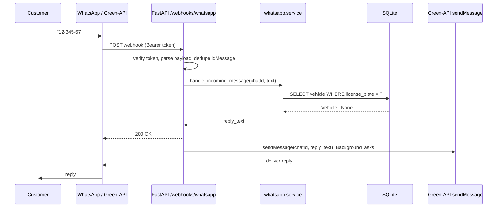

# Green-API WhatsApp Integration

## Provider recommendation

We're going with **Green-API** as you requested. It's the right fit for this project because:

- No Meta Business verification or 24-hour session window - uses a linked WhatsApp account
- Simple REST model: one endpoint to send (`sendMessage`), one webhook to receive (`incomingMessageReceived`)
- Works great for small/mid garage volumes and for an MVP
- Auth is simple: `idInstance` + `apiTokenInstance` in the URL; inbound webhook can be protected with a shared `Authorization: Bearer` token you configure in the Green-API console

Trade-offs to accept: requires a WhatsApp account linked to a phone that stays online (Green-API keeps the session via their cloud, but your number can get rate-limited/banned by WhatsApp if you spam). Fine for replying to inbound queries like ours.

## Environment variables (append to [app/settings.py](app/settings.py))

- `GREEN_API_BASE_URL` - e.g. `https://api.green-api.com` (Green-API assigns a per-instance host like `https://7103.api.greenapi.com`; keep it configurable)
- `GREEN_API_ID_INSTANCE` - numeric instance id
- `GREEN_API_TOKEN_INSTANCE` - API token for sending
- `GREEN_API_WEBHOOK_TOKEN` - shared secret, validated against the `Authorization: Bearer ...` header on inbound webhooks (set the same value in Green-API console → Instance settings → "Webhook authorization token")
- `WHATSAPP_ENABLED` - `"true"`/`"false"` kill-switch so we can deploy without a live instance
- `WHATSAPP_HTTP_TIMEOUT_SECONDS` - default `10`

We'll load them with `os.getenv` and centralise them next to the existing `DB_URL` / `ALLOWED_ORIGINS`.

## New dependency

Add to [requirements.txt](requirements.txt):

- `httpx>=0.27.0,<1.0.0` for async outbound calls (FastAPI already depends on it transitively, but pin it explicitly).

## Proposed module structure

New package `app/whatsapp/` that is completely self-contained and provider-swappable:

```
app/
  whatsapp/
    __init__.py
    schemas.py      # Pydantic models for Green-API webhook payloads
    client.py       # GreenApiClient: async sendMessage() wrapper (httpx)
    service.py      # handle_incoming_message(): pure business logic, takes (chat_id, text, db) -> reply text
    formatting.py   # format_vehicle_status(vehicle) -> str (Hebrew/English message templates)
  routers/
    whatsapp.py     # POST /webhooks/whatsapp -> parses payload, calls service, sends reply
```

Why this split:

- `schemas.py` isolates Green-API's payload shape so we only parse what we need and tolerate unknown fields
- `client.py` is the only file that talks HTTP to Green-API. If we ever swap to Meta/Twilio, only this file changes
- `service.py` has no FastAPI / HTTP dependencies, making it trivial to unit-test with an in-memory SQLite like [tests/conftest.py](tests/conftest.py) already does
- `formatting.py` centralises the user-facing copy and the `VehicleStatus` enum → human-readable mapping

## Webhook payload we expect to parse

Green-API sends `POST` with `Content-Type: application/json` and header `Authorization: Bearer <GREEN_API_WEBHOOK_TOKEN>`. We only care about `typeWebhook == "incomingMessageReceived"`; everything else returns 200 OK immediately.

Relevant shape (fields we consume are in bold in our Pydantic model; everything else is ignored via `model_config = ConfigDict(extra="ignore")`):

```json
{
  "typeWebhook": "incomingMessageReceived",
  "instanceData": { "idInstance": 7103000000, "wid": "972500000000@c.us", "typeInstance": "whatsapp" },
  "timestamp": 1588091580,
  "idMessage": "F7AEC1B7086ECDC7E6E45923F5EDB825",
  "senderData": {
    "chatId": "972541234567@c.us",
    "sender": "972541234567@c.us",
    "senderName": "John"
  },
  "messageData": {
    "typeMessage": "textMessage",
    "textMessageData": { "textMessage": "12-345-67" }
  }
}
```

Text can arrive in two shapes depending on whether WhatsApp detected a URL / quote:

- `typeMessage == "textMessage"` → `messageData.textMessageData.textMessage`
- `typeMessage == "extendedTextMessage"` → `messageData.extendedTextMessageData.text`

Our Pydantic model normalises both into a single `text: str | None` field using a `model_validator`. Any other `typeMessage` (image/audio/location/poll/etc.) is accepted but yields `text = None`, and we reply with a "please send a license plate" fallback.

The phone number to reply to is `senderData.chatId` (already in the `<msisdn>@c.us` format Green-API needs for `sendMessage`).

## API endpoint strategy

New router `app/routers/whatsapp.py`, included from [app/main.py](app/main.py):

- `POST /webhooks/whatsapp` - receives Green-API notifications
  - **Not** behind `verify_api_key`. Green-API doesn't know our `X-API-Key`. Instead we add a dedicated `verify_green_api_token` dependency that compares the `Authorization: Bearer ...` header to `GREEN_API_WEBHOOK_TOKEN` in constant time (`hmac.compare_digest`).
  - Returns `200 OK` as fast as possible on every valid-auth call, even for payloads we don't act on. Green-API retries on non-2xx, which would cause duplicate replies.
  - Delegates to `service.handle_incoming_message(...)` which: normalises the inbound text to a plate (see plate normalization below), validates it against `^\d{7,8}$`, queries the DB via `db.get(Vehicle, plate)`, and returns a reply string.
  - The outbound `sendMessage` call is fired **after** we've committed nothing and before returning. To keep the webhook fast and resilient to Green-API latency, we dispatch it via FastAPI `BackgroundTasks` so the HTTP 200 doesn't wait on the outbound request.
  - Idempotency: keep an in-memory LRU (`functools.lru_cache`-style dict capped at ~1000 entries) of recently seen `idMessage` values. If Green-API retries the same message, we short-circuit and return 200 without re-sending.

Flow diagram:




## Reply formatting (examples)

`formatting.py` maps the current `VehicleStatus` from [app/enums.py](app/enums.py) to customer-facing copy. The enum now has six values (`ticket_opened`, `mechanics`, `in_test`, `washing`, `ready_for_payment`, `ready`) and `estimated_completion` has been removed from the model ([app/models/vehicle.py](app/models/vehicle.py)), so there is no time estimate to surface.

Status → message map (MVP English; Hebrew can be swapped in later from the same module):

- `ticket_opened` → "We've opened a service ticket for your vehicle. We'll keep you posted."
- `mechanics` → "Our mechanics are working on your vehicle right now."
- `in_test` → "Your vehicle is being road-tested to verify the repair."
- `washing` → "Your vehicle is being washed — the last step before pickup."
- `ready_for_payment` → "Your vehicle is ready. Please settle payment so we can hand it over."
- `ready` → "Great news! Your vehicle is ready for pickup."

Template (no `estimated_line`, no timezone handling):

```
Hi {customer_name},
Status for plate {license_plate}: {status_copy}
— Garage
```

The map lives in a single `STATUS_MESSAGES: dict[VehicleStatus, str]` constant and `format_vehicle_status(vehicle)` uses it; any unknown enum value falls back to a generic "Your vehicle is currently in our care" string so a future enum addition can't crash the reply path.

## Edge cases to handle

- **Invalid/missing webhook token** → 401, log warning, do not leak which field failed.
- **Non-JSON or malformed body** → 422, logged; Green-API will retry but our dedupe cache will still no-op on repeats.
- `**typeWebhook` other than `incomingMessageReceived`** (outgoing, status, stateInstance, etc.) → 200 OK, no DB hit, no reply. Critical because Green-API sends many webhook types through the same URL.
- **Non-text message** (image, audio, location…) → reply: "Please send your license plate as a text message."
- **Empty/whitespace-only text** → same fallback.
- **Plate not found in DB** → reply: "We couldn't find a vehicle with plate {plate}. Please double-check and try again, or call us." Never leak other customers' data.
- **Plate normalization**: Israeli plates come in many formats (`12-345-67`, `1234567`, `123 45 67`, `12 345 678`). In `app/whatsapp/service.py` we strip **all non-digit characters** (`re.sub(r"\D", "", text)`) before the DB lookup, matching the new strict `^\d{7,8}$` rule enforced server-side. If the normalised result doesn't match that regex (too short, too long, or empty), we reply with an "invalid license plate format" fallback instead of querying the DB. The DB uses the same canonical digits-only form as the primary key.
- **Invalid plate format** (normalised length ≠ 7 or 8 digits) → reply: "That doesn't look like a valid license plate. Please send 7 or 8 digits, e.g. `1234567`." No DB hit.
- **Phone number mismatch**: a customer might message from a different number than the one in `Vehicle.phone_number`. MVP: reply based on plate alone (plate is the search key). Log a warning when `senderData.chatId` doesn't match the stored number so ops can catch impersonation if it ever matters.
- **Group chats**: `chatId` ending in `@g.us` instead of `@c.us` → ignore, do not reply (avoids spamming groups).
- **Duplicate delivery** from Green-API retries → in-memory `idMessage` dedupe LRU.
- **Green-API outage / non-2xx on `sendMessage`** → `GreenApiClient` logs, retries once with short backoff, then gives up. We've already 200'd the webhook, so no retry storm.
- `**WHATSAPP_ENABLED=false**` → `/webhooks/whatsapp` still returns 200 (so the webhook can be registered), but silently drops the message. `GreenApiClient.send_message` becomes a no-op that logs. Useful for CI/test environments.
- **Very long text** (Green-API caps at 20,000 chars) - not a concern since our replies are short, but we'll clamp defensively.
- **Unicode/RTL** (Hebrew customer names) - use `ensure_ascii=False` and UTF-8 throughout; httpx handles this natively.

## Testing strategy

Add `tests/test_whatsapp.py` mirroring the style of `tests/test_vehicles.py`:

- Unit tests for `service.handle_incoming_message` covering every edge case above, using the existing in-memory SQLite fixture.
- Unit tests for the Pydantic schema parsing both `textMessage` and `extendedTextMessage` variants plus a non-text payload.
- Integration test for `POST /webhooks/whatsapp` using `TestClient`, with `GreenApiClient.send_message` monkey-patched so no real HTTP fires. Assert the outbound call was scheduled with the expected `chat_id` and `message`.

## Rollout

1. Create a Green-API instance, link the garage WhatsApp account via QR.
2. Set env vars in the deploy environment.
3. In Green-API console → Notifications → set webhook URL to `https://<host>/webhooks/whatsapp` and set the Authorization token to match `GREEN_API_WEBHOOK_TOKEN`.
4. Enable only `incomingMessageReceived`; disable the others to reduce noise (we handle them correctly either way).
5. Send a WhatsApp to the garage number with a seeded test plate to verify the full loop.

