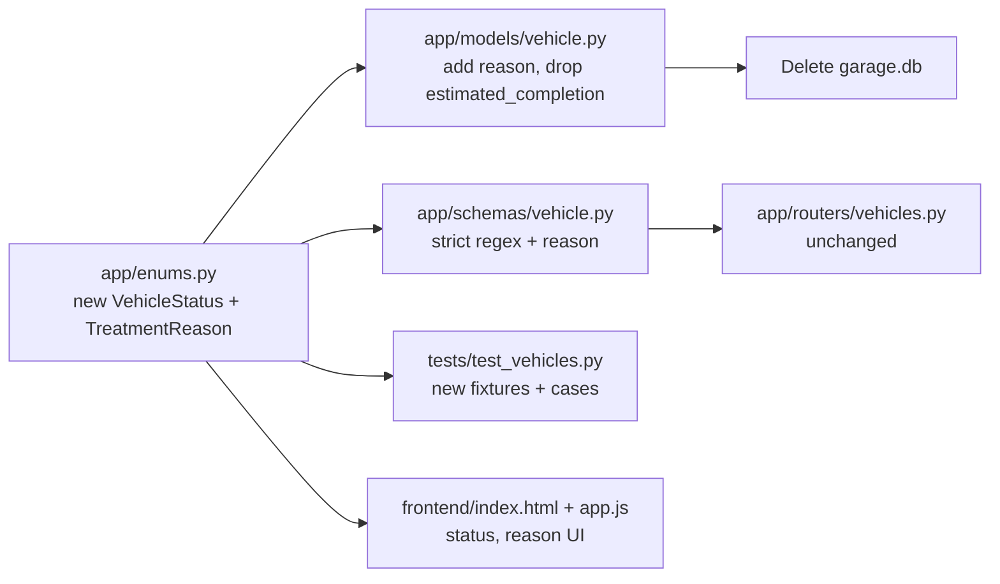

## Task 1 — Enums ([app/enums.py](app/enums.py))

Replace the file contents:

```python
import enum


class VehicleStatus(str, enum.Enum):
    ticket_opened = "ticket_opened"
    mechanics = "mechanics"
    in_test = "in_test"
    washing = "washing"
    ready_for_payment = "ready_for_payment"
    ready = "ready"


class TreatmentReason(str, enum.Enum):
    annual = "annual"
    accident = "accident"
    bodywork = "bodywork"
    diagnostics = "diagnostics"
```

## Task 2 — Model ([app/models/vehicle.py](app/models/vehicle.py))

- Import `TreatmentReason` alongside `VehicleStatus`.
- Remove the `estimated_completion` column entirely (and the now-unused `_UTCDateTime`/datetime imports can stay since `created_at`/`updated_at` still use them).
- Change the `status` default to `VehicleStatus.ticket_opened`.
- Add a non-nullable `reason` column:

```python
status: Mapped[VehicleStatus] = mapped_column(
    Enum(VehicleStatus), default=VehicleStatus.ticket_opened, nullable=False
)
reason: Mapped[TreatmentReason] = mapped_column(
    Enum(TreatmentReason), nullable=False
)
```

## Task 3 — Schemas ([app/schemas/vehicle.py](app/schemas/vehicle.py))

- Drop `AwareDatetime` import and all `estimated_completion` fields/validators.
- Import `TreatmentReason`.
- Replace the three validators with the strict regex-based versions:

```python
_PHONE_RE = re.compile(r"^05[023458]\d{7}$")
_NAME_RE = re.compile(r"^[A-Za-z\u0590-\u05FF]+ [A-Za-z\u0590-\u05FF]+$")
_PLATE_RE = re.compile(r"^\d{7,8}$")


def _validate_phone(v: str) -> str:
    digits = re.sub(r"[\s\-]", "", v.strip())
    if not _PHONE_RE.match(digits):
        raise ValueError(
            "Phone must be exactly 10 digits, start with '05', and the 3rd digit must be 0/2/3/4/5/8"
        )
    return digits


def _validate_name(v: str) -> str:
    v = v.strip()
    if not _NAME_RE.match(v):
        raise ValueError("Customer name must be exactly two words (Hebrew or English letters) separated by a single space")
    return v


def _validate_plate(v: str) -> str:
    stripped = re.sub(r"[\s\-]", "", v.strip())
    if not _PLATE_RE.match(stripped):
        raise ValueError("License plate must be exactly 7 or 8 digits")
    return stripped
```

- Update `VehicleCreate` / `VehicleUpdate` / `VehicleResponse`:
  - Remove `estimated_completion`.
  - Default `status` = `VehicleStatus.ticket_opened` in `VehicleCreate`.
  - Add required `reason: TreatmentReason` to `VehicleCreate` and `VehicleResponse`.
  - Add optional `reason: TreatmentReason | None = None` to `VehicleUpdate` with a not-null validator (matches the existing pattern for status).

## Task 4 — Frontend ([frontend/index.html](frontend/index.html), [frontend/app.js](frontend/app.js))

### index.html

- Table header: remove `<th>Est. Completion</th>` and add `<th>Reason</th>` (plus keep Added).
- Status `<select id="f-status">`: replace the four `<option>`s with six — `ticket_opened`, `mechanics`, `in_test`, `washing`, `ready_for_payment`, `ready` (human labels: "Ticket Opened", "Mechanics", "In Test", "Washing", "Ready for Payment", "Ready").
- Remove the entire `f-completion` `<div>` block (label + datetime-local input).
- Add a new required `<select id="f-reason">` with options `annual`, `accident`, `bodywork`, `diagnostics` (labels "Annual", "Accident", "Bodywork", "Diagnostics").
- Update placeholders to reflect the new rules (e.g. plate placeholder `"e.g. 1234567"`, phone placeholder `"0501234567"`).

### app.js

- Rewrite `STATUS` map with the six new keys and tasteful Tailwind colors (e.g. ticket_opened=gray, mechanics=orange, in_test=purple, washing=cyan, ready_for_payment=amber, ready=green).
- Rewrite `STATS_META` to six cards: `all`, `ticket_opened`, `mechanics`, `in_test`, `ready_for_payment`, `ready` (drop the waiting_parts/in_progress cards) — keep the `lg:grid-cols-5` layout or bump to `lg:grid-cols-6`.
- Add a `REASONS` map `{ annual: 'Annual', accident: 'Accident', bodywork: 'Bodywork', diagnostics: 'Diagnostics' }`.
- `renderRow`: drop the `completion` cell, add a `<td>` rendering `REASONS[v.reason]`.
- `openModal`: drop the `f-completion` assignment; set `document.getElementById('f-reason').value = v.reason` when editing, and reset it to `annual` when adding.
- `handleFormSubmit`: read `f-reason`, drop `completion`, include `reason` in the payload (both create and update).
- `validateForm`: replace existing checks with:
  - Plate (new only): strip `[\s-]`, must match `/^\d{7,8}$/`.
  - Name: must match `/^[A-Za-z\u0590-\u05FF]+ [A-Za-z\u0590-\u05FF]+$/`.
  - Phone: strip `[\s-]`, must match `/^05[023458]\d{7}$/`.
  - Reason: must be a non-empty value from the enum.
  - Drop the `completion > now` check.

## Task 5 — Tests ([tests/test_vehicles.py](tests/test_vehicles.py))

Update fixtures + assertions to the new schema:

- `_VALID_PLATE = "1234567"` (7 digits; test an 8-digit variant too).
- `_VALID_PAYLOAD` = `{ "license_plate": "1234567", "customer_name": "Jane Doe", "phone_number": "0501234567", "reason": "annual" }`.
- `test_create_vehicle`: assert `status == "ticket_opened"` and `reason == "annual"`.
- Remove `test_create_vehicle_with_aware_estimated_completion`, `test_create_naive_estimated_completion_rejected`, `test_patch_naive_estimated_completion_rejected`.
- Drop `_AWARE_DT` / `_NAIVE_DT` constants.
- In `test_create_invalid_fields` parametrize with cases that exercise the new regexes, e.g.:
  - `("license_plate", "ABC1234")` — has letters.
  - `("license_plate", "123456")` — too short.
  - `("customer_name", "Jane")` — only one word.
  - `("customer_name", "Jane123 Doe")` — contains digits.
  - `("phone_number", "0511234567")` — invalid third digit.
  - `("phone_number", "050123456")` — only 9 digits.
  - missing `reason` field — expect 422.
- `test_patch_explicit_null_rejected` parametrize: keep `customer_name`, `phone_number`, `status`; add `reason`.
- `_create_n` uses numeric plates: `f"{1000000 + i}"` (always 7 digits).

## Task 6 — Database reset

After the code changes compile, delete the local SQLite file so SQLAlchemy recreates it on next startup:

```powershell
Remove-Item .\garage.db -Force
```

## Flow summary


